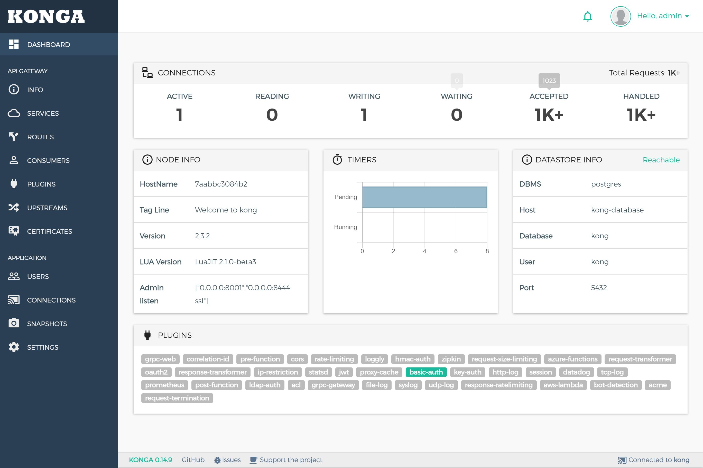
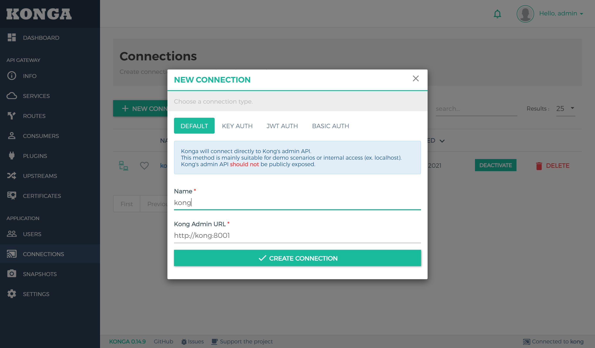
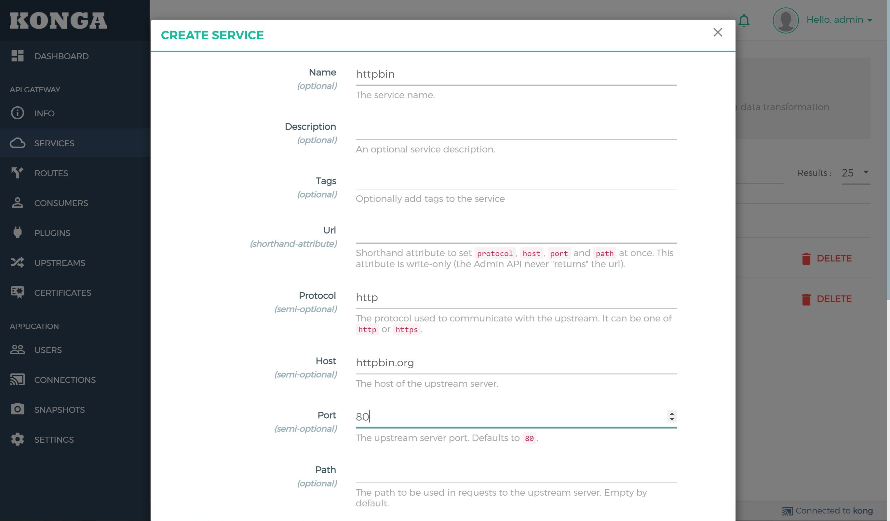
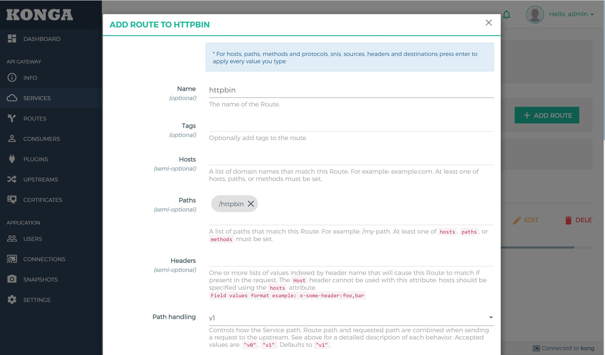

# KONG API Gateway Example


Kong API Gateway deployment with docker and docker-compose

Service Connectivity for
Modern Architectures
Build apps faster with a full-stack platform that seamlessly delivers API management, Ingress, and Service Mesh. Multi-clouds and Kubernetes native.




**Official Stte** https://konghq.com

## Quick start

```
docker-compose up -d
```

**Now KONG is running on default**
- Kong Proxy HTTP http://127.0.0.1:8000
- Kong Proxy HTTPS http://127.0.0.1:8443
- Kong Admin  http://127.0.0.1:8001
- KONG Admin SSL http://127.0.0.1:8444


### Create account for manage
register input username , email , password for login to kongka

### Add New Connection
- enter name
- enter kong admin api : in this case use docker-compose can call name | http://{host}/port
- create connection



- you can see dashboard

### Router to service
1. create add new service



2. add route in service



### Basic Auth Access Plugin


